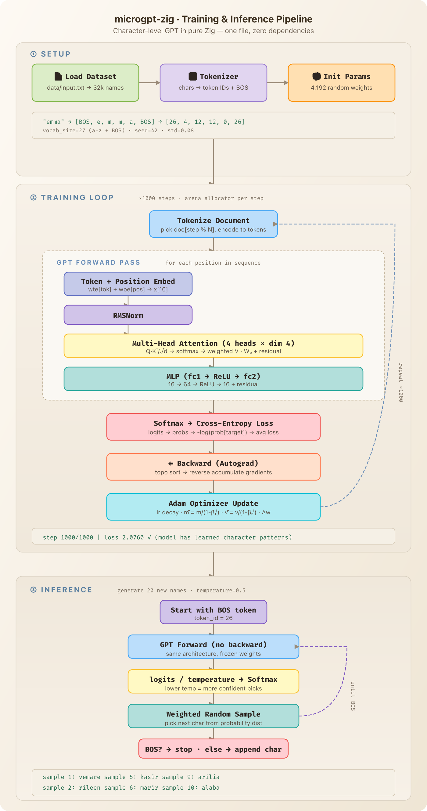

# microgpt-zig

A pure Zig port of Karpathy's [microgpt.py](https://gist.github.com/karpathy/8627fe009c40f57531cb18360106ce95) — the most atomic way to train and run a GPT, with zero dependencies.

Everything lives in a single file: autograd, tokenizer, transformer, training loop, and inference. No frameworks, no libraries, just Zig.

## How It Works

The program trains a tiny character-level GPT on a dataset of names, then generates new ones. Here's the full pipeline:



## Quick Start

```bash
# Requires: Zig 0.15.x

# Build and run (downloads names dataset on first run)
zig build run -Doptimize=ReleaseFast

# Or use the task runner
task demo            # English names
task demo:korean     # Korean (Hangul) names
```

## Sample Output

```
num docs: 32033
vocab size: 27
num params: 4192
step 1000 / 1000 | loss 2.0760
--- inference (new, hallucinated names) ---
sample  1: vemare
sample  2: rileen
sample  3: ariren
sample  4: amelen
sample  5: kasir
```

Korean output (`task demo:korean`):
```
num docs: 263
vocab size: 58
num params: 5184
step 1000 / 1000 | loss 1.0310
--- inference (new, hallucinated names) ---
sample  1: 서원
sample  2: 수윤
sample  3: 지예
sample  4: 지준
sample  5: 태영
```

## Architecture

Everything is in [`src/main.zig`](src/main.zig):

| Component | Description |
|-----------|-------------|
| `Value` | Autograd node: data, grad, children, local_grads, backward() |
| `Tokenizer` | Character ↔ token ID mapping with BOS token |
| `StateDict` | All model parameters: embeddings, attention, MLP weights |
| `gpt()` | Forward pass: embed → RMSNorm → attention → MLP → logits |
| `backward()` | Topological sort + reverse gradient accumulation |
| `main()` | Training loop (Adam + LR decay) → inference (temperature sampling) |

## Hyperparameters

| Parameter | Value | Description |
|-----------|-------|-------------|
| `n_layer` | 1 | Transformer layers |
| `n_embd` | 16 | Embedding dimension |
| `block_size` | 16 | Max context length |
| `n_head` | 4 | Attention heads |
| `num_steps` | 1000 | Training steps |
| `lr` | 0.01 | Learning rate (linear decay) |

## Custom Datasets

Pass any text file (one name per line) as argument:

```bash
zig build run -Doptimize=ReleaseFast -- my_names.txt
```

## Performance Enhancements

Baseline (730 LoC, ReleaseFast on Apple Silicon):
- **4.94s** wall, **4.41s** user, **16.3MB** RSS, **47B** instructions retired

Planned Zig-specific optimizations, applied and measured one at a time:

| # | Enhancement | Rationale | Wall | LoC | Status |
|---|-------------|-----------|------|-----|--------|
| 0 | Baseline | — | 4.94s | 730 | done |
| 1 | Eliminate backward() HashMap | backward() uses `AutoHashMap(*Value, void)` as a visited set — every node requires pointer hashing, collision handling, and dynamic table resizing. Adding a `gen: u32` field to Value and comparing against a per-step generation counter replaces all of this with a single integer compare per node. | 1.52s | 729 | done |
| 2 | Direct neg/div operations | `neg(a)` allocates a `-1.0` leaf + `mul` node (2 nodes). `div(a,b)` allocates `pow(b,-1)` + `mul` (2 nodes, and `pow` is expensive). Direct implementations halve the node count for these ops, reducing both forward allocation and backward traversal. `softmax()` calls `div` once per logit, so this compounds across the vocab. | — | — | pending |
| 3 | FixedBufferAllocator for per-step arena | The per-step `ArenaAllocator` uses `page_allocator` as backing, which calls `mmap`/`munmap` every time a new page is needed. Replacing it with a `FixedBufferAllocator` over a single pre-allocated buffer eliminates all syscalls during the step — pure pointer bumps only. | — | — | pending |
| 4 | Comptime-specialized linear() | `linear()` loops over `w.len` and `row.len` which are runtime values, preventing the compiler from unrolling. Since all call sites use comptime-known dimensions (16, 64, vocab_size), making the sizes `comptime` lets LLVM unroll inner loops and schedule instructions better. | — | — | pending |

## Reference

Port of Karpathy's [microgpt.py](https://gist.github.com/karpathy/8627fe009c40f57531cb18360106ce95) — *"The most atomic way to train and run inference for a GPT in pure, dependency-free Python."*

This is the Zig equivalent. Everything else is just efficiency.
